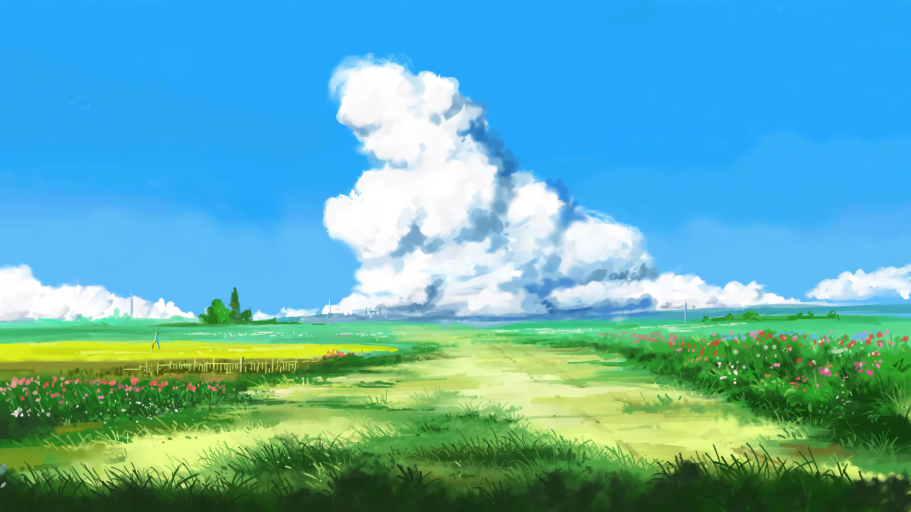
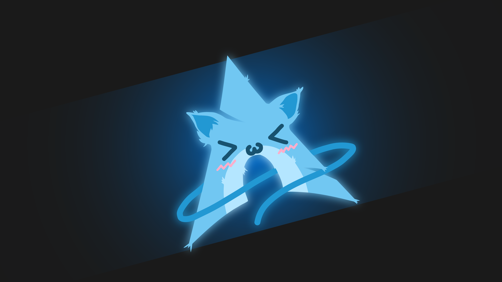
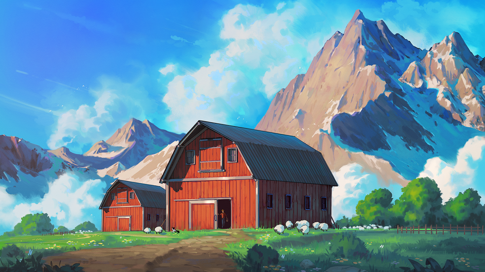

# My Arch config

## install & init
```shell
bash install.sh
```

## wallpapers
000.jpg

001.png

002.jpg

003.jpg

004.png

005.png

006.jpg

007.png

008.png

009.png

010.png

011.png

012.png

013.png

014.png

015.png

016.png

017.png

018.jpg

019.png

020.png

021.png

022.png

023.png

024.png

025.png

026.png

027.jpg

028.jpg

029.png

030.png

031.png

032.jpg

033.png

034.png

035.jpg

036.jpg

037.jpg

038.jpg

039.png

040.png

041.png

042.png

043.jpg

044.jpg

045.png

046.jpg

047.jpg

048.jpg

049.jpg

050.jpg

051.png

052.png

053.jpg

054.png

055.jpg

056.jpg

057.png

058.jpg

059.png

060.png

061.jpg

062.jpg

063.jpg

064.jpg

065.png

066.jpg

067.png

068.png

069.jpg

070.png

071.png

072.jpg

073.jpg

074.jpg

075.jpg

076.png

077.png

078.png

079.png

