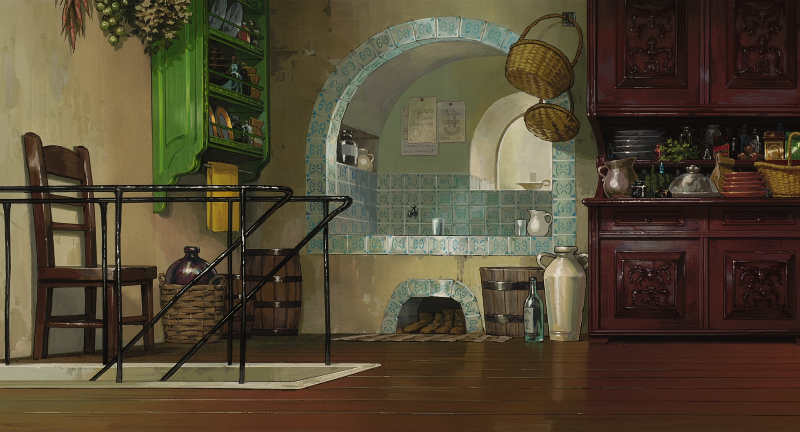
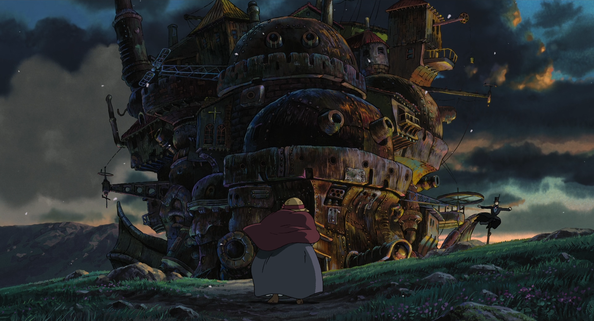
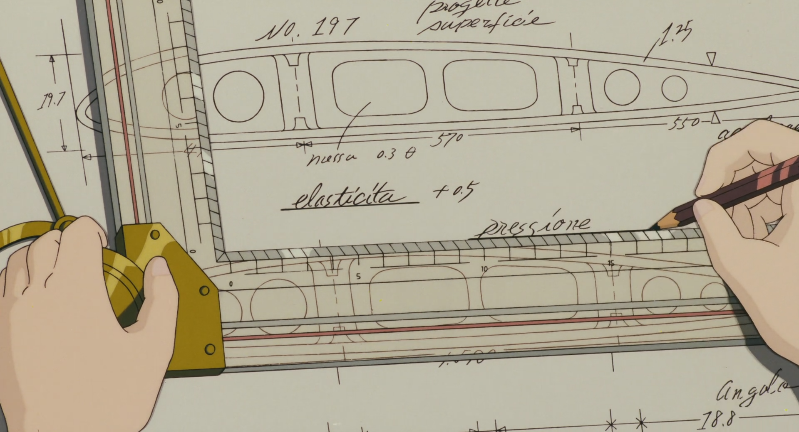
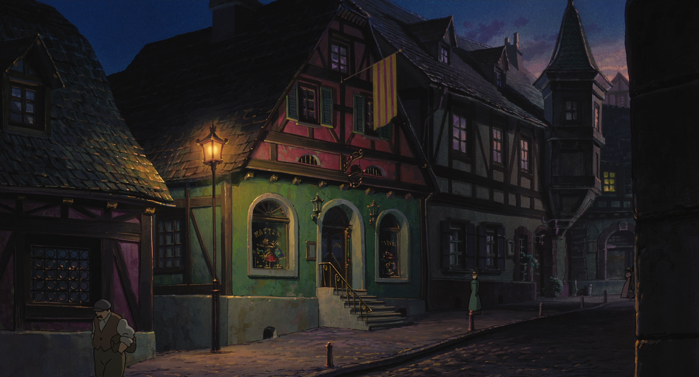
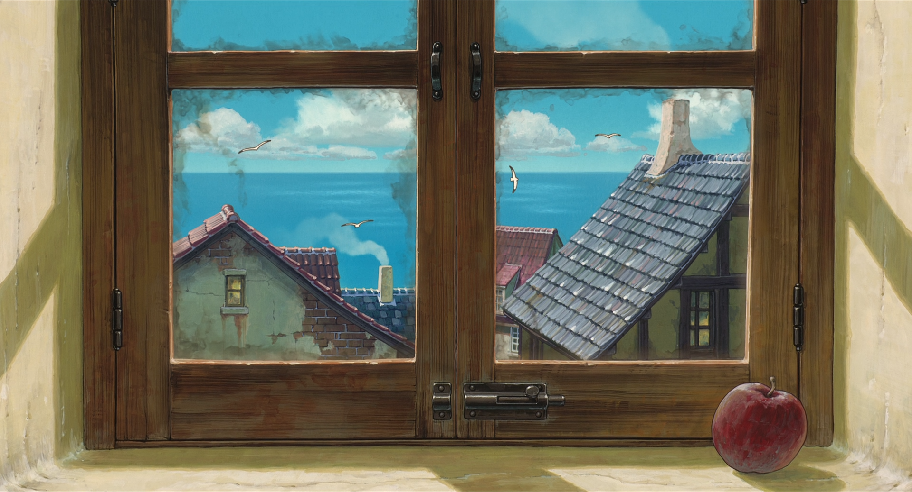
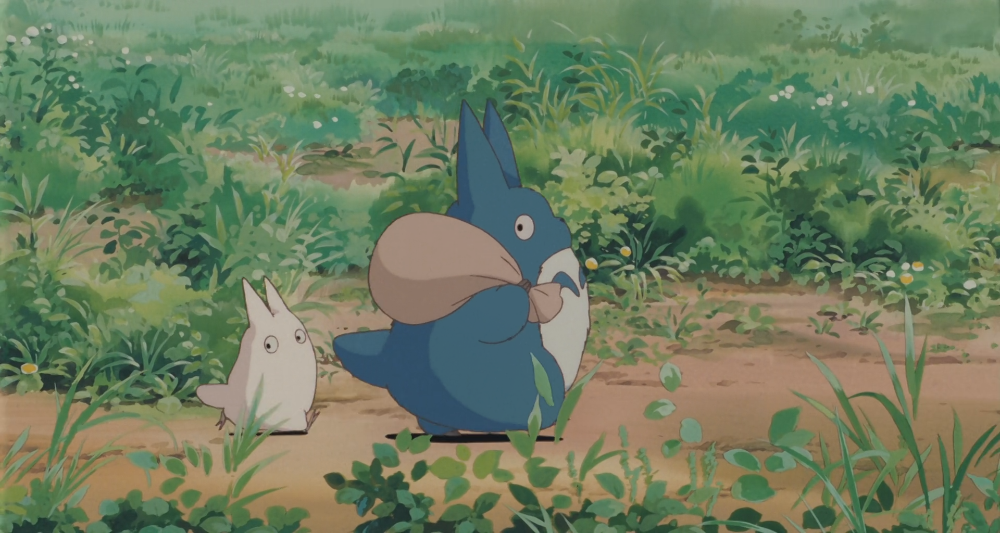
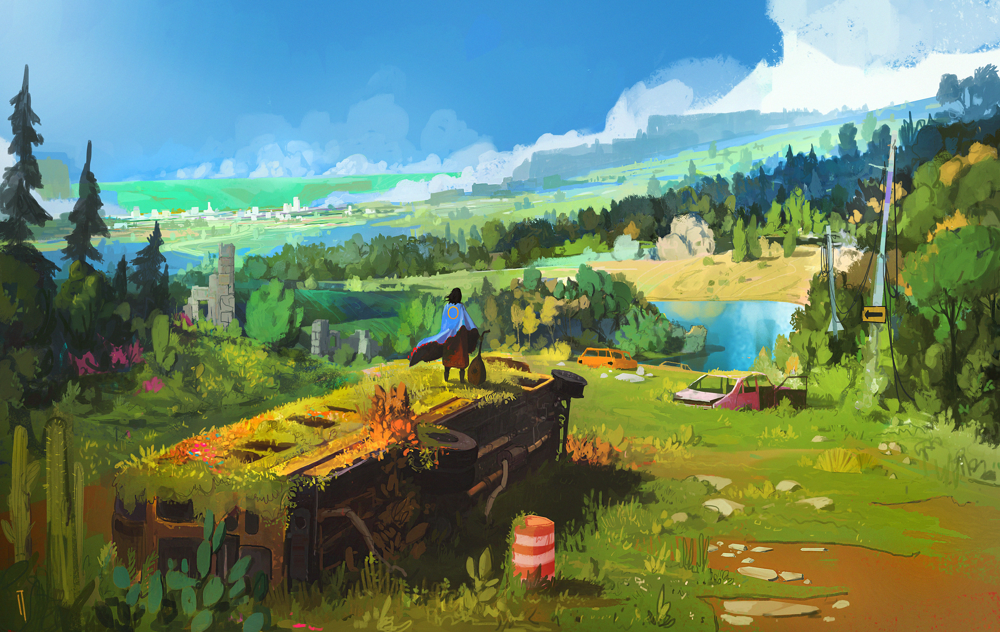
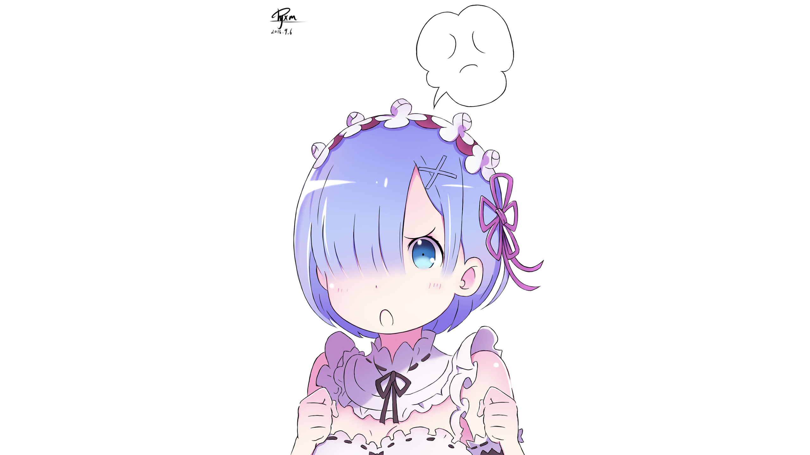
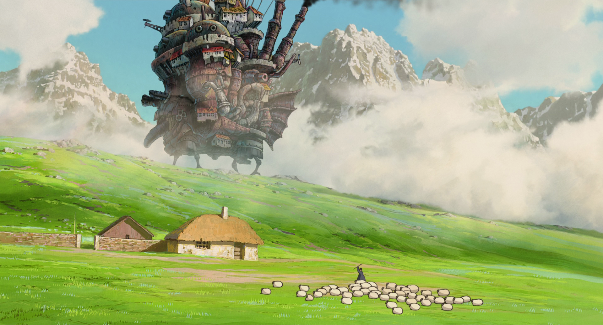

# My Arch config

## install & init
```shell
bash install.sh
```

## wallpapers
000.jpg

001.png

002.jpg

003.jpg

004.png

005.png

006.jpg

007.png

008.png

009.png

010.png

011.png

012.png

013.png

014.png

015.png

016.png

017.jpg

018.png

019.png

020.png

021.png

022.png

023.png

024.png

025.png

026.jpg

027.jpg

028.png

029.png

030.jpg

031.png

032.png

033.jpg

034.jpg

035.jpg

036.jpg

037.png

038.png

039.png

040.png

041.jpg

042.jpg

043.png

044.jpg

045.jpg

046.jpg

047.jpg

048.jpg

049.png

050.png

051.jpg

052.png

053.jpg

054.jpg

055.png

056.jpg

057.png

058.png

059.jpg

060.jpg

061.jpg

062.jpg

063.png

064.jpg

065.png

066.png

067.jpg

068.png

069.png

070.jpg

071.jpg

072.jpg

073.jpg

074.png

075.png

076.png

077.png

