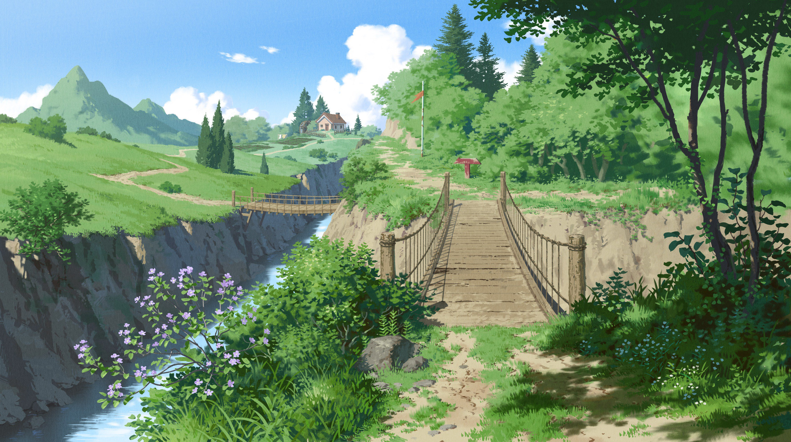

# My Arch config

## install & init
```shell
bash install.sh
```

## wallpapers
000.jpg

001.png

002.jpg

003.png

004.jpg

005.png

006.png

007.png

008.png

009.png

010.png

011.png

012.png

013.png

014.jpg

015.png

016.png

017.png

018.png

019.png

020.png

021.png

022.png

023.jpg

024.jpg

025.png

026.png

027.jpg

028.png

029.png

030.jpg

031.jpg

032.jpg

033.jpg

034.png

035.png

036.png

037.png

038.jpg

039.jpg

040.png

041.jpg

042.jpg

043.jpg

044.jpg

045.jpg

046.png

047.png

048.jpg

049.png

050.jpg

051.jpg

052.png

053.jpg

054.png

055.png

056.jpg

057.jpg

058.jpg

059.jpg

060.png

061.jpg

062.png

063.png

064.jpg

065.png

066.png

067.jpg

068.jpg

069.jpg

070.jpg

071.png

072.png

073.png

074.png

