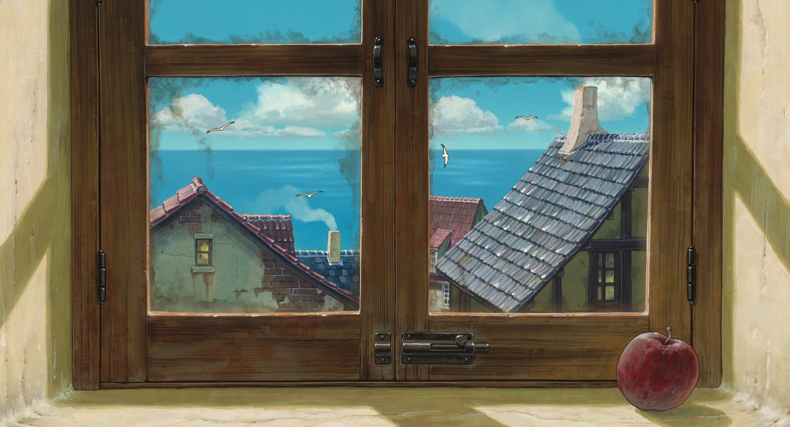
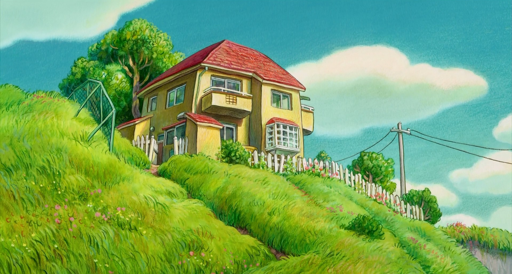

# My Arch config

## install & init
```shell
bash install.sh
```

## wallpapers
000.jpg

001.png

002.jpg

003.jpg

004.png

005.png

006.png

007.png

008.png

009.png

010.png

011.png

012.jpg

013.png

014.png

015.png

016.png

017.png

018.png

019.png

020.png

021.jpg

022.jpg

023.png

024.jpg

025.png

026.png

027.jpg

028.jpg

029.jpg

030.jpg

031.png

032.png

033.png

034.png

035.jpg

036.jpg

037.png

038.jpg

039.jpg

040.jpg

041.jpg

042.jpg

043.png

044.png

045.jpg

046.png

047.jpg

048.jpg

049.png

050.jpg

051.png

052.png

053.jpg

054.jpg

055.jpg

056.jpg

057.png

058.jpg

059.png

060.png

061.jpg

062.png

063.png

064.jpg

065.jpg

066.jpg

067.jpg

068.png

069.png

070.png

071.png

072.jpg

